# Exercise 1: Create App Service Plan & Web App
Azure App Service is a fully managed Platform-as-a-Service (PaaS) offering from Microsoft Azure that enables you to:
- Deploy web apps (ASP.NET, Node.js, Python, Java, PHP, static sites)
- Scale automatically based on demand
- Secure with built-in HTTPS, authentication, and compliance
- Integrate with databases, APIs, and DevOps pipelines

### **Task 1: Create App Service Plan**
1. Search for "App Services" In the Azure Portal top search bar, type "App Services" and select it from the dropdown.
   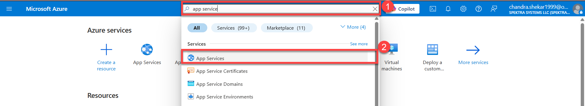

1. Click + "Create" On the App Services page, click the + "Create" button, Select "Web App" Choose "Web App" from the creation options.
   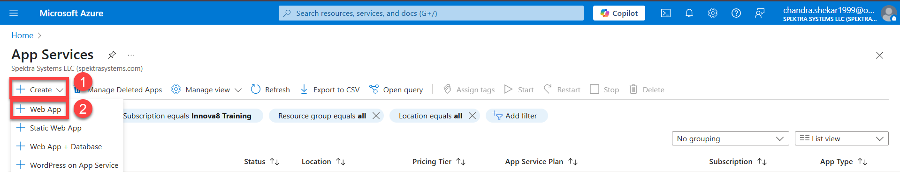  

1. Subscription & Resource Group : Select the Subscription innov8 and Resource Group: Select the pre-created lab RG (e.g., chandra.shekar1999-RG). Name Your Web App Enter a globally unique name (e.g., webapp-[yourinitials]-001). Runtime Stack Publish: Code (default) Runtime stack: Select Node.js 18 LTS (or your lab’s specified stack).
Note: Azure will validate availability with a green checkmark.
   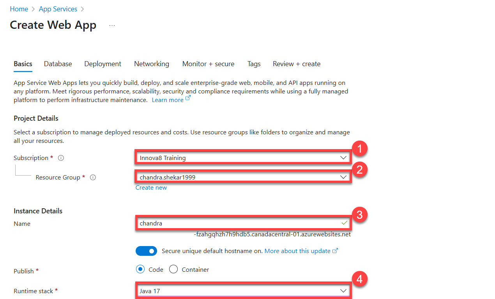

1. Operating System : Select Linux (or Windows if specified in lab).Region Choose the region closest to you (e.g., West US). And Create a New Linux Plan and the prizing plan as Primium V3 POV3 to perform. And Click on for Next Database for the Next Step.
   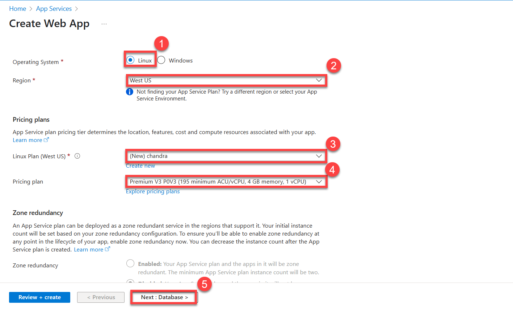
   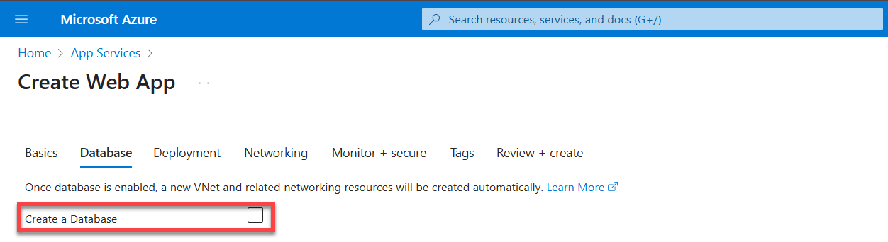
   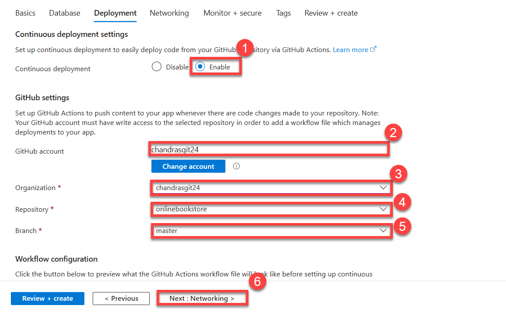
   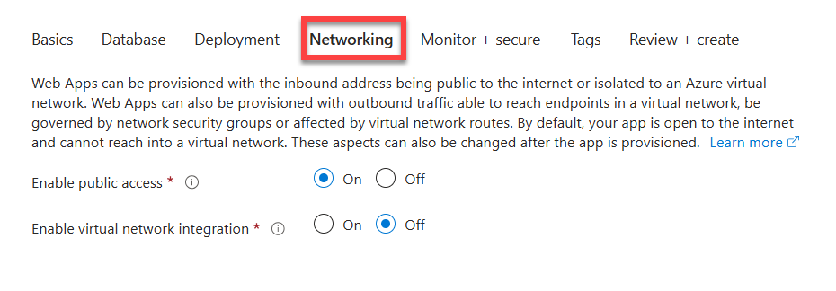
   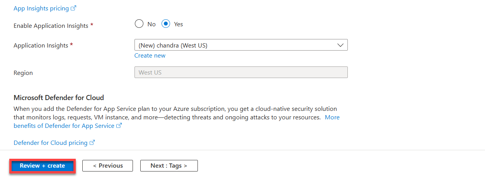 
   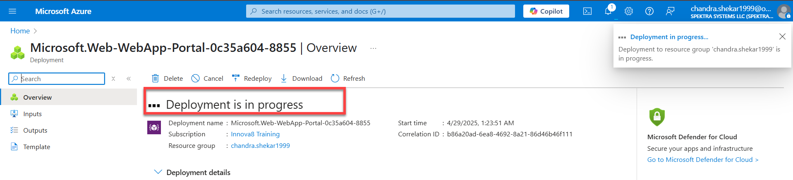
   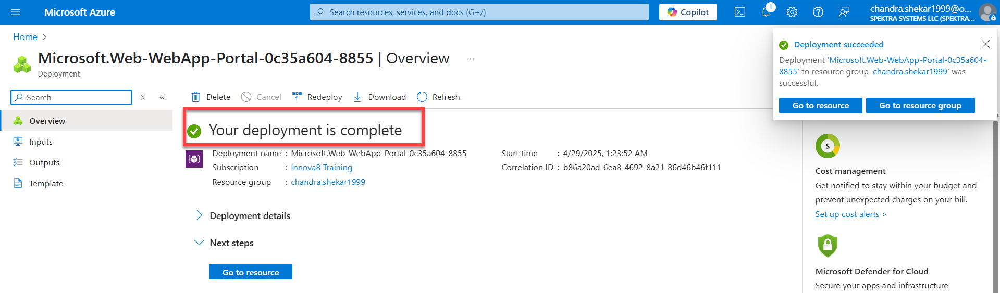

Task 3: Create and Set Up App Service Plan
Create New App Service Plan Click "Create new" under App Service Plan. Plan Name Enter a name (e.g., ASP-SpektraLab-001).
   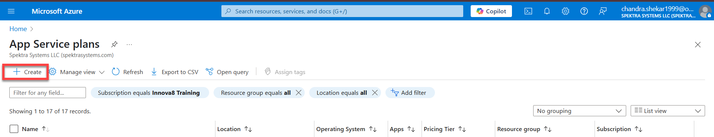
   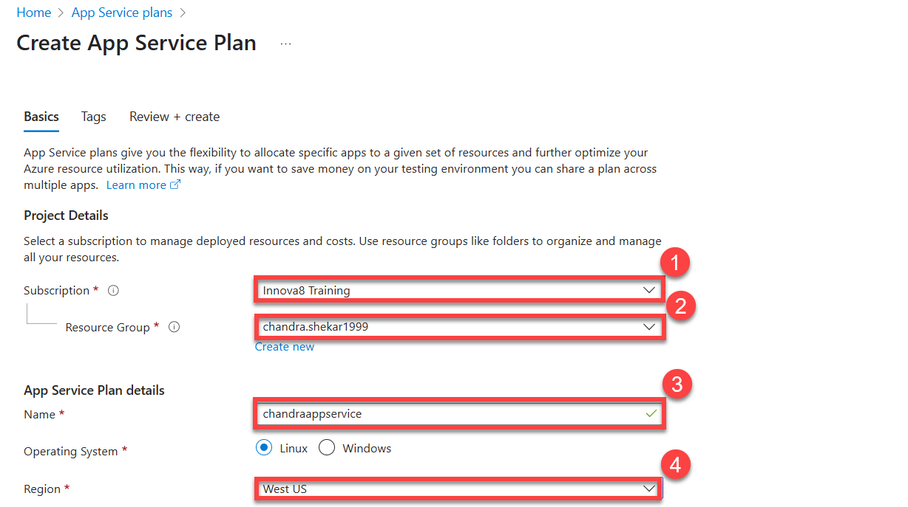
   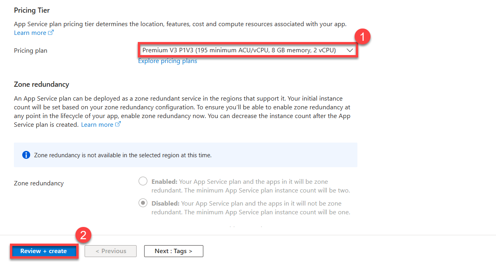
   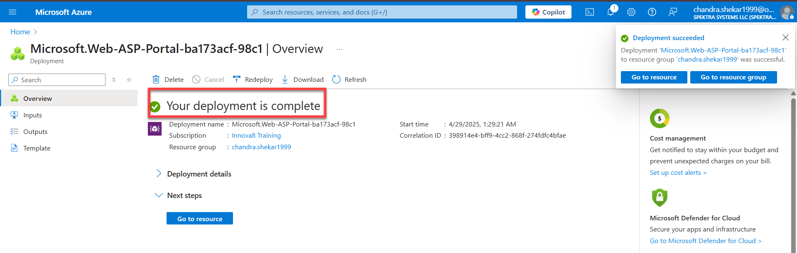
   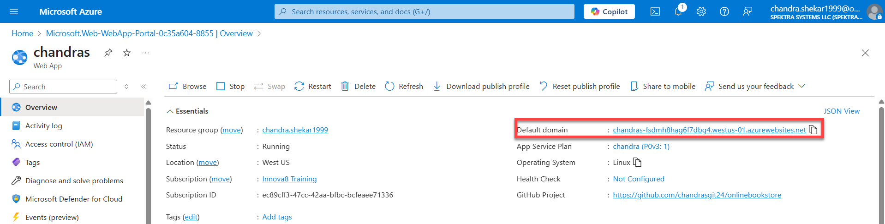
Pricing Tier

Select Free (F1) for the lab.

Note: For production, use Premium tiers.
(Screenshot: Pricing tier blade with "Free F1" selected)

Click "OK"

Confirm the plan settings.
(Screenshot: "OK" button highlighted)

Task 4: Review + Create
Skip Tags (Lab Only)

Tags are optional for this lab.

Click "Review + Create"

Validate all settings.
(Screenshot: "Review + create" button highlighted)

Deploy

Click "Create" to deploy.

Wait for the green "Deployment complete" notification (~1-2 mins).
(Screenshot: Deployment progress bar and success notification)

Task 5: Access Your Web App
Go to Resource Click "Go to resource" post-deployment.
   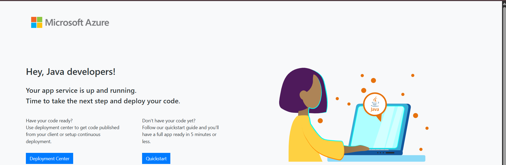  
   
Test Default Page

Under the "Overview" tab, click the URL (e.g., https://webapp-[yourinitials]-001.azurewebsites.net).

A default "Your App Service app is up and running" page should load.
