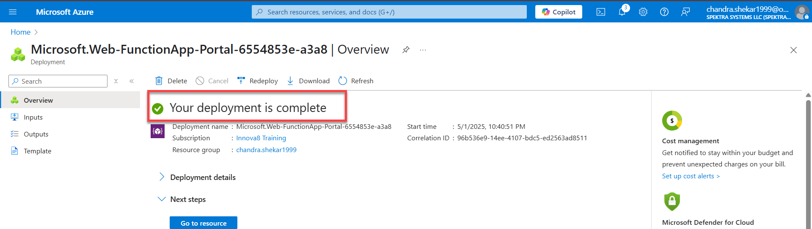

# Exercise 1: Implementing an Azure Blob-Triggered Function to Log Image Name and Size
## Objective
In this lab, you will implement an Azure Function that automatically triggers when a new image is uploaded to an Azure Blob Storage container. The function will extract and log the file name and file size of the uploaded image.This guide uses Azure Portal only.

## Pre-requisites
- Access to Azure Portal via CloudLabs or personal subscription.
- Contributor role assigned to your account.
- A Resource Group available to deploy resources.

### **Task 1: Create a Storage Account**
Azure Storage is a Microsoft-managed service providing cloud storage that is highly available, secure, durable, scalable, and redundant. Azure Storage includes Azure Blobs (objects), Azure Data Lake Storage Gen2, Azure Files, Azure Queues, and Azure Tables. The cost of your storage account depends on the usage and the options you choose.

1. In the Azure Portal click on search bar and Search for "Storage account" and select it.
   

1. In 2nd Step Click on create "Create".
   
   
1. Fill in the details: In basic Tab
-  Subscription: Select the active one.
-  Resource Group: Choose an existing one or create a new one.
-  Storage account name: e.g., imgstorlab123 (must be globally unique).
-  Region: Choose the closest region.
-  Leave other options as default.
-  Click "Review + create", then "Create".
   
   
-  Wait for your Deployment to complete and you will see the pop up displaying like below Your deployment is completed.
   

   
### **Task 2: Create a Blob Container**
1. After deployment, go to the Storage Account. In the left menu on the overview section, click "Containers" under Data storage.
   
  
1. Name it e.g., images, and set Public access level to Private.Click "Create".
   

### **Task 3: Create a Function App**
Create a function app, which lets you group functions as a logical unit for easier management, deployment and sharing of resources. Functions lets you execute your code in a serverless environment without having to first create a VM or publish a web application.

1. Click "Create a resource" > search for "Function App" > select and click "Create".
   

1. On the Basics tab:
-   Type : consumption and click on next part
    
-   Subscription: Select yours.
-   Resource Group: Use the same one.
-   Function App name: e.g., imgtriggerfunc123 (unique).
-   Publish: Code.
-   Runtime stack: Python or .NET (Python preferred for simplicity).
-   Version: Latest available.
-   Region: Same as storage account.
-   Click on next storage account part
    

On the Hosting tab:
-   Storage account: Select the storage account you created.Leave the rest as default click on > Review + Create > Create,
    
    
    Your Deployment will be completed as shown in fig.
    

### **Task 4: Add a Blob Trigger Function**
-   Go to your Function App. and in overview section Click "Functions" > + create function.
    
    
-   Choose "Select a template" > Click "Continue".Select "Blob trigger" > and click on Next Continue.
    
    
-   Fill the form:
-   Job Type : Default
-   Function name: e.g., LogImageInfo.
-   Path: images/{name} (match the container name).
-   Storage account connection: Select the existing one, Click Create.
    

### **Task 5: Function Code**
-   Go to your new function (LogImageInfo). Click "Code + Test". You can see the default code with the following example (Python): Click on save and go to storage account part.
    

### **Task 6: Test the Trigger**
-   Go back to your Storage Account >overview >images  Containers.
    

-   Click "Upload" > Select a small image file (.jpg, .png).Click "Upload".
    

### **Task 7: Verify Logs in Azure Portal**
-   Go to Function App >Overview> Functions > LogImageInfo.Click "Logs" to view output.

Verify:
Image name is logged.
Image size is logged.
   

Click "Logs" to view output Expected Output. A successful trigger execution when an image is uploaded.Logged information with: Image file name.Image file size in bytes.
   
