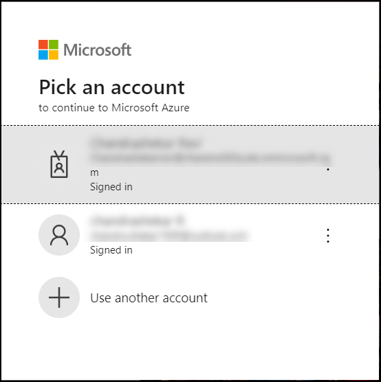
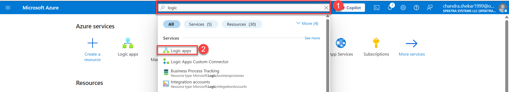
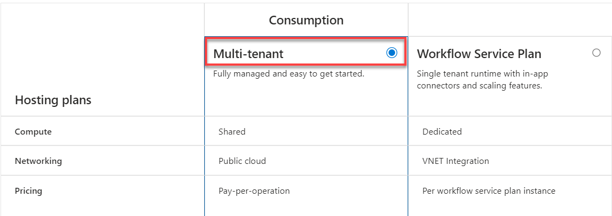
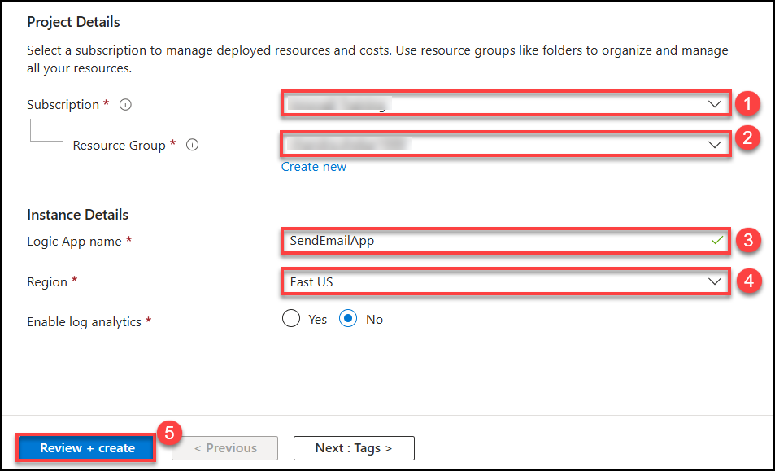

# Exercise 1: Create a Logic App that Trigers and Sends an email to yourself with the message: "Hello from Logic Apps"!

### Step 1: Sign in to Azure Portal
1. Open a Chrome browser and go to: https://portal.azure.com. Log in using your Azure credentials.
   
   
### Step 2: Create a Logic App
1. In the Search bar at the top, type: Logic Apps and press Enter. Click Logic Apps from the list. Click + Create.
   
   
1. Select the plan type as **consumption** of Multitenant and Fill the required fields: After that click on review+create

| Field          | Value                        |
| -------------- | ---------------------------- |
| Subscription   | (Select your subscription)   |
| Resource Group | Create new (e.g., `LogicRG`) |
| Logic App Name | `SendEmailApp`               |
| Region         | East US      |

  
  
