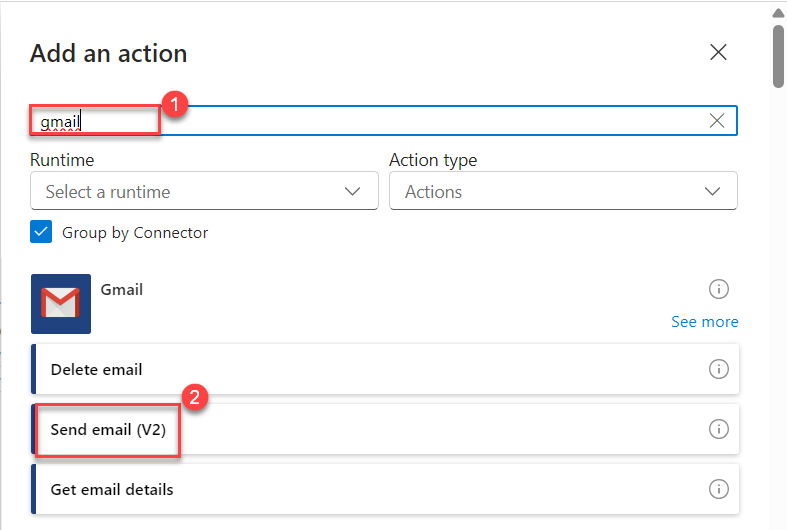

# Exercise 1: Create a Logic App that Trigers and Sends an email to yourself with the message: "Hello from Logic Apps"!

## Introduction
Azure Logic Apps is a cloud-based service that allows you to automate workflows and integrate systems and services — all without writing any code. It enables you to connect to hundreds of services like email, databases, file systems, Microsoft Teams, SharePoint, and more, using a simple visual designer.

In this lab, you will learn how to create a Logic App that automatically sends an email every minute. This hands-on exercise introduces the core concepts of Logic Apps such as triggers, actions, and workflow monitoring.

This is an ideal starting point for users who want to:Build automated workflows
Send alerts, notifications, or approvals
Integrate cloud services in a no-code/low-code environment

## Pre-requisites to Use Azure Logic Apps
1. **Access Requirements**
Azure Account: You must have access to a valid Azure subscription.
Contributor Role: Your account should have Contributor or higher permissions to create and manage Logic Apps and related resources.

2. **Resource Setup**
Azure Resource Group: A resource group should be available (or you can create a new one) to contain your Logic App.
Region Selection: Choose a supported Azure region when creating your Logic App (e.g., East US, West Europe).

3. **Connectivity & Services Internet Access**: Required to connect Logic Apps with external services like Outlook, Gmail, Teams, etc.
Email Account: You need a valid Outlook (Office 365) or Gmail account to test email-based Logic App workflows.

## Step 1: Sign in to Azure Portal
1. Open a Chrome browser and go to: https://portal.azure.com. Log in using your Azure credentials.
   
   
1. After login to the azure portal In the Search bar at the top type: Logic Apps and press Enter. Click Logic Apps from the list. Click + Create.
   
   
1. Fill the required fields as mentioned below: After that click on review+create

   | Field          | Value                        |
   | -------------- | ---------------------------- |
   | Subscription   | (Select your subscription)   |
   | Resource Group | select existing (e.g., `LogicRG`) |
   | Logic App Name | `SendEmailApp`               |
   | Region         | East US      |
 
     
   
1. After clicking review+create your deployment will be completed as shown below, Once deployment is done, click Go to Resource In the new page.
   

1. In the overview click Logic App Designer Scroll down and select Blank Logic App
    

1. Now in the logic app designer Add a Trigger In the Logic App Designer, search for Recurrence Select Recurrence (Schedule)
    

1. Enter the interval as 1 and Frequency in Minutes and click on save
   

1. Now Add an Action to Send Email using Gmail

   

1. Search for Gmail, Select Send email v2 (Gmail) and Sign in and allow access

    

10. Configure Email Details Fill in the following details: Connection name: Enter you connection name Eg:chandra.  Authenticator type : Bring your own application. Client ID: Your own email address. Give the secret pass and click on sign in
    

11. Fill in the following details: To: Your own email address. Subject: Test Email from Logic App. Body: Hello from Logic Apps! This is chandra
    

12. After that click on save and go for next step
    

13. Validate the Result Wait for 1–2 minutes Check your email inbox as shown below and You should see an email from Logic App
    

14. View Run History Go to your Logic App → Click Overview Scroll to Runs history Click on a run → View Trigger and Action status
    

15. Disable the Logic App (to stop emails)Go back to your Logic App overview Click Disable (from the top menu bar)
    
   
### Lab Summary
-   In this lab, you successfully created your first Azure Logic App — a powerful no-code workflow automation tool. You configured a recurring trigger to run every minute and added an email action to automatically send a message using your preferred email provider.
-   This lab introduced you to: Navigating the Azure Portal Creating and configuring a Logic App from scratch
-   Working with connectors like Outlook or Gmail
-   Monitoring Logic App runs and status

You’ve now laid the foundation for building more advanced workflows and business process automations using Azure Logic Apps. With this skill, you can begin integrating cloud services, automating repetitive tasks, and simplifying your operations
